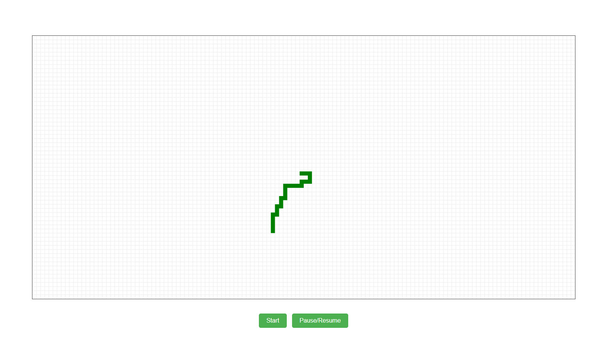

# 🐍 snakes-ai

A classic Snake game built with plain JavaScript and the HTML5 Canvas API. The long-term goal is to add an AI mode that lets the snake play itself; for now, the project contains the core game.

No frameworks, no build step, no dependencies: open `index.html` in a browser and play.

<!-- TODO: add a screenshot or GIF of the game running, e.g.  -->



## Features

- **Classic Snake gameplay** rendered on an HTML5 `<canvas>`
- **Grid overlay** drawn on a separate canvas layer, so the board grid is rendered once and the game canvas only redraws what moves
- **Start** and **Pause/Resume** controls
- **Zero dependencies**: vanilla JavaScript, HTML and CSS

## Getting started

### Run locally

```bash
git clone https://github.com/picasso1807/snakes-ai.git
cd snakes-ai
```

Then open `index.html` in any modern browser.

If you prefer serving it over HTTP (recommended to avoid browser file-access quirks), any static server works:

```bash
# Node.js
npx serve .

# or Python
python -m http.server 8000
```

and visit `http://localhost:8000` (or the port shown).

## How to play

1. Click **Start** to begin a game.
2. Click **Pause/Resume** to pause or continue.
3. **Arrow keys** to move snake to a direction.

## AI mode (planned)

The AI is not implemented yet. The plan is to add a self-running mode where the snake chooses its own moves, finding the food while avoiding walls and its own body. The game logic is kept in separate modules so an AI controller can be plugged in alongside manual input.

## Project structure

```
snakes-ai/
├── index.html            # Entry point: canvases, buttons, script includes
├── scripts/
│   ├── constants.js      # Game configuration (grid size, speed, colours, etc.)
│   ├── canvas-helper.js  # Canvas drawing utilities (grid, cells, clearing)
│   ├── snake.js          # Snake state, movement, growth and collision logic
│   └── handlers.js       # UI and input event handlers (Start, Pause/Resume)
├── styles/
│   └── styles.css        # Layout and styling for the game container and buttons
├── LICENSE
└── README.md
```

Scripts are loaded in order from `index.html`, so `constants.js` and `canvas-helper.js` are available to `snake.js` and `handlers.js`.

## Tech stack

- JavaScript (ES6+)
- HTML5 Canvas
- CSS3

## Roadmap

- [x] Core Snake game on HTML5 Canvas
- [x] Start and Pause/Resume controls
- [x] Adjustable game speed
- [ ] AI self-running mode
- [ ] Toggle between manual and AI play from the UI
- [ ] Score and high-score tracking
- [ ] Live demo via GitHub Pages

## Contributing

Issues and pull requests are welcome. For larger changes, please open an issue first to discuss what you'd like to change.

## License

Released under the [MIT License](LICENSE).